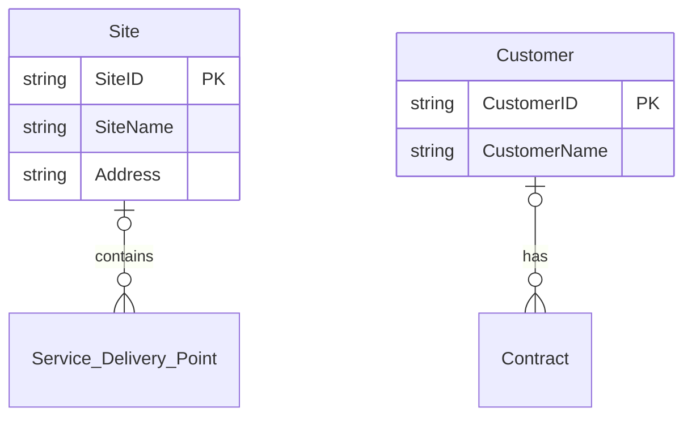

# ERD Generator Documentation

## Overview

The ERD Generator is a new tool in EAModeler that automates the creation of Mermaid.js diagrams from CSV files defining a canonical logical data model. It can generate both Entity Relationship Diagrams (ERD) and Class Diagrams based on specified data domains.

## Function Signature

```python
def generate_mermaid_diagram(
    classes_csv_path: str,
    attributes_csv_path: str,
    relationships_csv_path: str,
    data_domains: List[str],
    diagram_type: str = "erDiagram",
    output_dir: str = "output"
) -> Path:
```

## Input CSV Files

The tool requires three CSV files with specific column structures:

### 1. Classes CSV (`classes.csv`)

Defines the entities/classes in the data model.

**Required columns:**
- `Data Domain`: Business domain (e.g., "Site", "Customer & Contract")
- `Data Entity`: Entity name (e.g., "Site", "Customer")

**Example:**
```csv
Data Domain,Data Entity,Description
Site,Site,Physical location where services are delivered
Customer & Contract,Customer,Organization receiving services
```

### 2. Attributes CSV (`attributes.csv`)

Defines the attributes for each entity.

**Required columns:**
- `Data Entity`: Entity the attribute belongs to
- `Attribute`: Attribute name
- `Data Type`: Data type (e.g., "string", "integer", "LOV")
- `PK`: Primary Key indicator ("yes"/"no")

**Example:**
```csv
Data Entity,Attribute,Data Type,PK,Description
Site,SiteID,string,yes,Unique identifier for the site
Site,SiteName,string,no,Name of the site
Customer,CustomerID,string,yes,Unique identifier for customer
```

### 3. Relationships CSV (`relationships.csv`)

Defines relationships between entities.

**Required columns:**
- `Parent Entity`: Entity on the "one" side
- `Child Entity`: Entity on the "many" side  
- `Parent to Child Verb Phrase`: Relationship label
- `Cardinality`: Relationship type ("1:N", "1:1", "N:M")

**Example:**
```csv
Parent Entity,Child Entity,Parent to Child Verb Phrase,Cardinality,Description
Site,Service Delivery Point,contains,1:N,A site contains multiple delivery points
Customer,Contract,has,1:N,A customer can have multiple contracts
```

## Usage

### Command Line Interface

Generate an ERD for specific domains:
```bash
uv run eamodeler gen-erd input/classes.csv input/attributes.csv input/relationships.csv "Site" "Customer & Contract"
```

Generate a Class Diagram:
```bash
uv run eamodeler gen-erd input/classes.csv input/attributes.csv input/relationships.csv "Finance" --diagram-type classDiagram
```

Multiple domains:
```bash
uv run eamodeler gen-erd input/classes.csv input/attributes.csv input/relationships.csv "Site" "Finance" "HR"
```

### Python API

```python
from eamodeler.utils.erd_generator import generate_mermaid_diagram

# Generate ERD for Site and Customer domains
output_file = generate_mermaid_diagram(
    classes_csv_path="input/classes.csv",
    attributes_csv_path="input/attributes.csv",
    relationships_csv_path="input/relationships.csv",
    data_domains=["Site", "Customer & Contract"],
    diagram_type="erDiagram",
    output_dir="output"
)
```

## Features

### Domain Filtering
- Filters entities based on specified data domains
- Only includes relationships where both entities are in selected domains
- Validates domain names against available data

### Diagram Types
- **erDiagram**: Entity Relationship Diagrams
- **classDiagram**: UML-style Class Diagrams

### Cardinality Mapping
The tool maps relationship cardinalities to Mermaid syntax:
- `1:N` → `|o--o{`
- `1:1` → `|o--||`
- `N:M` → `}o--o{`
- Others → `--`

### Text Sanitization
- Automatically sanitizes entity and attribute names for Mermaid compatibility
- Replaces spaces and special characters with underscores
- Ensures valid identifier format

### Primary Key Handling
- Identifies primary keys from the PK column
- Sorts attributes with primary keys first
- Adds "PK" suffix to primary key attributes

## Output

### File Structure
Generated files include:
- Mermaid diagram code block
- Entity summary table
- Metadata (domains, entity count, relationship count)

### File Naming
Files are automatically named based on domains and diagram type:
- `Site_Customer_Contract_erDiagram.md`
- `Finance_classDiagram.md`

### Sample Output
```markdown
# Erdiagram for Data Domains: Site, Customer & Contract

**Entities included:** 5  
**Relationships included:** 4  
**Data Domains:** Site, Customer & Contract



## Error Handling

The tool provides comprehensive error handling:
- **FileNotFoundError**: Missing CSV files
- **ValueError**: Missing required columns or invalid data
- **Encoding Issues**: Automatic encoding detection for CSV files

## Testing

Use the provided test script to verify functionality:
```bash
python test_erd_generator.py
```

This runs three test cases:
1. ERD for Site and Customer & Contract domains
2. Class Diagram for HR domain  
3. ERD for all domains

## Dependencies

- pandas: CSV file processing
- pathlib: File path handling
- re: Text sanitization