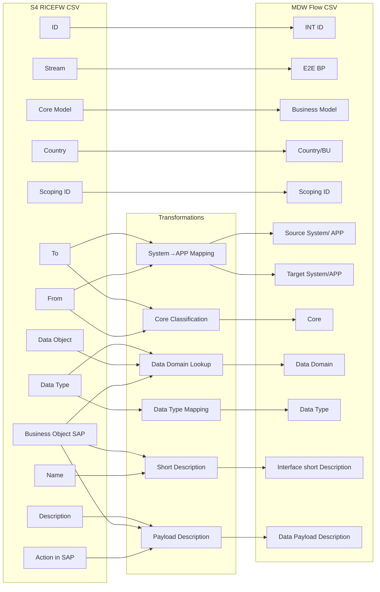

# transfRICEFW - S4 RICEFW to MDW Flow Transformer

## Overview

The `transfRICEFW` utility transforms S4 RICEFW interface definition CSV files into the MDW Flow format. This tool automates the conversion of interface metadata from SAP S/4HANA project documentation into a standardized format for the MDW (Middleware) Flow inventory.

## Usage

### Command Line Interface

```bash
# Basic usage (output in same directory as input)
uv run eamodeler transfRICEFW <input_file>

# Specify output directory
uv run eamodeler transfRICEFW <input_file> --output-dir <output_directory>
```

### Examples

```bash
# Transform S4RICEFW.csv, output to same directory
uv run eamodeler transfRICEFW input/S4RICEFW.csv

# Transform and output to specific directory
uv run eamodeler transfRICEFW input/S4RICEFW.csv --output-dir output/
```

### Output

The tool generates a file named `{input_filename}_output.csv` in the specified output directory.

---

## Input Format

### Required CSV Columns

The input CSV file must contain the following columns:

| Column Name | Description |
|-------------|-------------|
| `ID` | Interface identifier |
| `Stream` | Business process stream |
| `Business activity (BPML level 4)` | Business process activity |
| `Core Model` | Core model classification |
| `Country` | Country code |
| `Name` | Interface name |
| `Business Object SAP` | SAP business object type |
| `Action in SAP` | Action performed in SAP |
| `Scoping` | Scoping information |
| `Scoping ID` | Scoping identifier |
| `Status` | Interface status |
| `Description` | Interface description |
| `RICEFW  Type` | RICEFW classification type |
| `Pilot / Roll-out` | Deployment phase |
| `Quantity` | Quantity information |
| `From` | Source system |
| `To` | Target system |
| `Data Type` | Data type classification |
| `Data Object` | Data object type |

### Row Filtering

Only rows matching the following criteria are processed:

- `RICEFW  Type` = `'Interface'`
- `Status` in `{'Validated', 'To review'}`

---

## Output Format

### Output Columns

| Column | Description |
|--------|-------------|
| `New/Review` | Status indicator (always "New") |
| `Comments` | Comments field (empty) |
| `Scoping ID` | Direct mapping from input |
| `E2E BP` | End-to-end business process |
| `Data Domain` | Calculated data domain |
| `Business Model` | Business model classification |
| `Core` | Core system classification |
| `Data Type` | Transformed data type |
| `Reference` | Reference type (always "RICEFW") |
| `seq` | Sequence number (empty) |
| `Country/BU` | Country/Business Unit |
| `Status` | Status (always "In Definition") |
| `INT ID` | Interface ID |
| `Interface short Description` | Generated description |
| `Source System/ APP` | Mapped source application |
| `Target System/APP` | Mapped target application |
| `Integration Pattern` | Integration pattern (empty) |
| `Direction` | Direction (empty) |
| `Middleware` | Middleware (empty) |
| `Protocol` | Protocol (empty) |
| `Data Payload Format` | Payload format (empty) |
| `Data Payload Description` | Generated payload description |

---

## Transformation Rules

### 1. Constant Values

| Output Column | Value |
|---------------|-------|
| `New/Review` | `"New"` |
| `Status` | `"In Definition"` |
| `Reference` | `"RICEFW"` |

### 2. Direct Mappings

| Output Column | Input Column |
|---------------|--------------|
| `Scoping ID` | `Scoping ID` |
| `E2E BP` | `Stream` |
| `Business Model` | `Core Model` |
| `Country/BU` | `Country` |
| `INT ID` | `ID` |

### 3. Data Type Transformation

**Function:** `transform_data_type()`

| Input Value | Output Value |
|-------------|--------------|
| `Master Data` | `Master` |
| `Transactional Data` | `Transactional` |
| Other | Original value |

**Location:** `src/eamodeler/utils/ricefw_transformer.py`

```python
mapping = {
    'Master Data': 'Master',
    'Transactional Data': 'Transactional'
}
```

### 4. System to APP Code Mapping

**Functions:** `determine_source_app()`, `determine_target_app()`

Both functions use a shared lookup table `SYSTEM_TO_APP_MAPPING` to convert system names to standardized APP codes.

**Current Mapping Table:**

| Input System | Output APP Code |
|--------------|-----------------|
| `Anaplan` | `APP-0109 - Anaplan` |
| `Diapason` | `APP-0090 - Diapasan` |
| `ESKER` | `APP-0366 - Esker` |
| `HR System` | `APP-0009 - HR employee records` |
| `MDM` | `APP-0011 - MDM` |
| `NMO` | `APP-0367 - NMO` |
| `Operational ERP` | `APP-0374 - PROGIB` |
| `Payroll system` | `APP-0009 - HR employee records` |
| `S4` | `APP-0376 - SAP 4/HANA` |
| `T&E System` | `APP-0088 - SAP Concur` |
| `Thetys` | `APP-0159 - Thetys` |
| `Thetys Mandate` | `APP-0330 - Thétys Mandat` |
| `Data` | `APP-0204 - Azure Datalake` |
| `Data platefom` | `APP-0204 - Azure Datalake` |
| `Data platfom` | `APP-0204 - Azure Datalake` |
| `Datalake` | `APP-0204 - Azure Datalake` |
| `HMRC` | `UK-9995 - Unknown - HMRC` |
| `MDM  Cost` | `APP-0011 - MDM` |
| `MDM  Profit` | `APP-0011 - MDM` |
| `PowerBI` | `APP-0204 - Azure Datalake` |

**Default behavior:** If the system name is not found in the table, the original value is returned.

**To update:** Edit the `SYSTEM_TO_APP_MAPPING` dictionary in `src/eamodeler/utils/ricefw_transformer.py`

### 5. Core Classification

**Function:** `determine_core()`

Determines whether the interface is between core systems, local systems, or a mix.

**Core Apps:** `S4`, `NMO`, `Esker`, `MDM` (case-insensitive)

**Logic:**

| From System | To System | Output |
|-------------|-----------|--------|
| Core | Core | `core - core` |
| Local | Local | `local - local` |
| Core | Local | `core - local` |
| Local | Core | `core - local` |

**To update:** Edit the `core_apps` set in the `determine_core()` function:

```python
core_apps = {'s4', 'nmo', 'esker', 'mdm'}
```

### 6. Data Domain Determination

**Function:** `determine_data_domain()`

Determines the data domain based on `Business Object SAP` and `Data Object` columns. Only applies when `Data Type` is `'Master Data'`.

**Lookup Table (`DATA_DOMAIN_MAPPING`):**

| Business Object SAP | Data Object | Data Domain |
|---------------------|-------------|-------------|
| `G/L Account` | `Chart of Accounts` | `Financial Organization↳Group Chart of Account Hierarchy` |
| `Supplier` | `Supplier` | `Supplier↳Business partner` |
| `GL Accounts structure` | `GL Accounts` | `Financial Organization↳Group Chart of Account Hierarchy` |
| `Group chart of account (Anaplan GL accounts hierarchy)` | `GL Accounts` | `Financial Organization↳Group Chart of Account Hierarchy` |
| `Cost center` | `Cost Center` | `Financial Organization↳Cost Center` |
| `Profit center` | `Profit Center` | `Financial Organization↳Profit Center` |
| `Retail Site` | `Profit Center group` | `Site↳Site` |
| `Profit center` | `Operational Hierarchy` | `Financial Organization↳Profit Center Hierarchy` |
| `Customer` | `Customer` | `Customer & Contract↳Customer` |
| `Customer hierarchy` | `Customer` | `Customer & Contract↳Customer` |
| `Business partner (Supplier master data)` | `Supplier` | `Supplier↳Business partner` |
| `Value list (Supplier & product)` | `Value list` | `Product↳Price Conditions` |
| `Bank` | `Supplier` | `Supplier↳Supplier bank Details` |
| `Plant` | `SDP` | `Site↳SDP` |
| `Product` | `Raw Materials` | `Product↳Material master data/ Product` |

**Default behavior:** Returns empty string if:
- `Data Type` is not `'Master Data'`
- No match found in the lookup table

**To update:** Edit the `DATA_DOMAIN_MAPPING` dictionary in `src/eamodeler/utils/ricefw_transformer.py`

### 7. Interface Short Description

**Function:** `transform_short_description()`

Concatenates `Name` and `Business Object SAP` with a space separator.

**Formula:** `"{Name} {Business Object SAP}"`

### 8. Data Payload Description

**Function:** `transform_data_payload_description()`

Generates a description from action, business object, and description fields.

**Formula:** `"{Action in SAP} {Business Object SAP}: {Description}"`

---

## How to Update Transformations

### Adding New System Mappings

1. Open `src/eamodeler/utils/ricefw_transformer.py`
2. Find the `SYSTEM_TO_APP_MAPPING` dictionary
3. Add new entries:

```python
SYSTEM_TO_APP_MAPPING = {
    # ... existing entries ...
    'New System Name': 'APP-XXXX - New System Description',
}
```

### Adding New Data Domain Mappings

1. Open `src/eamodeler/utils/ricefw_transformer.py`
2. Find the `DATA_DOMAIN_MAPPING` dictionary
3. Add new entries with tuple keys:

```python
DATA_DOMAIN_MAPPING = {
    # ... existing entries ...
    ('New Business Object', 'New Data Object'): 'New Data Domain↳Category',
}
```

### Updating Core Apps List

1. Open `src/eamodeler/utils/ricefw_transformer.py`
2. Find the `determine_core()` function
3. Update the `core_apps` set:

```python
core_apps = {'s4', 'nmo', 'esker', 'mdm', 'new_core_app'}
```

### Modifying Filter Criteria

To change which rows are processed:

1. Open `src/eamodeler/utils/ricefw_transformer.py`
2. Find the `transform_ricefw()` function
3. Update the `valid_statuses` set and filter condition:

```python
valid_statuses = {'Validated', 'To review', 'New Status'}
df = df[
    (df['RICEFW  Type'] == 'Interface') & 
    (df['Status'].isin(valid_statuses))
].copy()
```

---

## Transformation Flow Diagram



---

## File Locations

| File | Purpose |
|------|---------|
| `src/eamodeler/utils/ricefw_transformer.py` | Main transformation logic and lookup tables |
| `src/eamodeler/cli/main.py` | CLI command definition |
| `docs/transfRICEFW.md` | This documentation |
